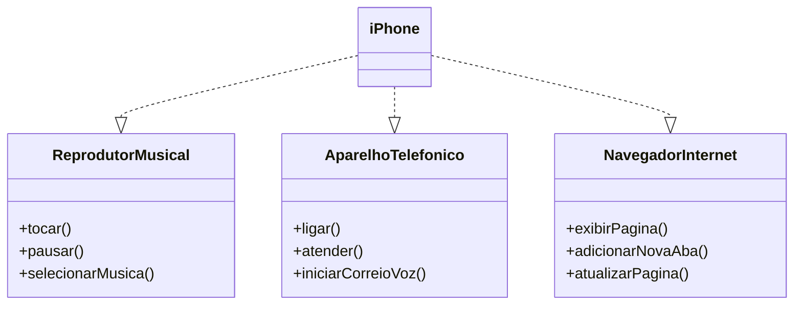

## ✨ Desafio - Modelagem UML e Programacao Orientada a Objetos com Java

Este projeto foi desenvolvido com o objetivo de colocar em prática conceitos de **análise de negócios**, **levantamento de requisitos**, **programação orientada a objetos (POO)** e **modelagem UML**, conforme proposto no desafio da formação.

A partir do vídeo de lançamento do iPhone ([iPhone 2017 - YouTube](https://www.youtube.com/watch?v=9ou608QQRq8)), foi feita a modelagem de um sistema que representa os principais papéis de um iPhone:

*  **Reprodutor Musical**
*  **Aparelho Telefônico**
*  **Navegador na Internet**

### 🧹 O que foi feito:

* Criação de **interfaces Java** representando os papéis acima;
* Implementação da **classe `iPhone`**, que integra todas as funcionalidades;
* Elaboração de um **diagrama de classes UML**;
* Organização do projeto com boas práticas de estrutura e nomeação.

### 🔧 Tecnologias utilizadas:

* Java
* UML (com Mermaid)
* IDE: VS Code / Eclipse / IntelliJ
* Git e GitHub

### 🖋️ Diagrama de Classes (UML)

---
